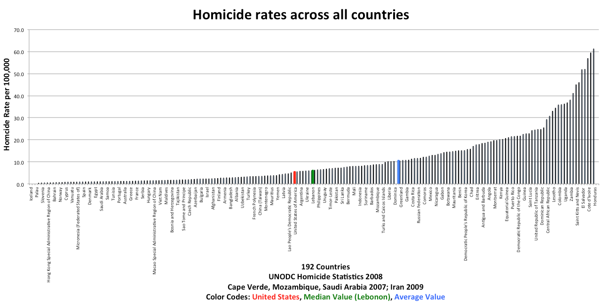
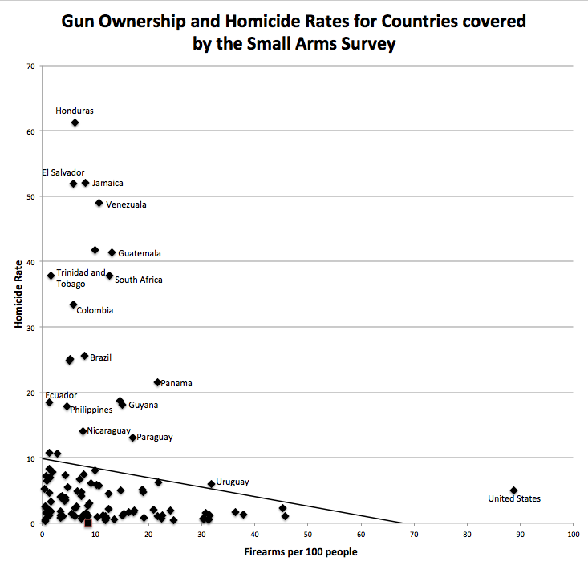
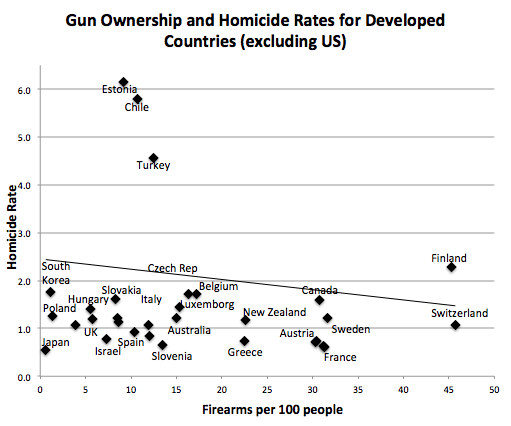

I am a gun owner.  Shocking right, a technology person that isn't so liberal that they don't own guns.  But wait, important people say I shouldn't own guns!  They kill!  Apparently the people who think we as citizens should not own guns are getting in trouble for guns!

+ David Malik - Arrested at Cleveland Hopkins Airport for having a concealed firearm in his carry-on luggage.  This guy is an anti-gun civil rights attorney.
  + [Cleveland.com](http://www.cleveland.com/metro/index.ssf/2015/02/prominent_cleveland_civil_righ.html)
+ Dwayne Ferguson - School lockdown because he carried it onto the campus of a Buffalo elementary school, a gun control activist!  Sentenced to 100 hours community service, only...
  + [WIVB.com](http://wivb.com/2014/02/07/reports-of-man-with-gun-near-elementary-school/)
+ Leland Yee - California Senator!  Supported all kinds of legislation to strip citizens of California of their rights.  Arrested on political corruption, rackateering, and gun trafficking!
+ Richard Mell - helped craft Chicago's handgun ban, forgot to register his firearms.  Tried to introduce legislation to allow him to register his firearms by re-opening the amnesty period.
+ Frank Melton - Routinely violated firearms laws, like carrying on a plane.  He was "asked" to not do that anymore.

You can NOT make this stuff up.  There are lots of instances of this type of stuff happening.  Then again, gun control isn't about controlling guns.  It is about controlling people.  You can't push your will onto an armed population afterall.

But I am just a backwards redneck right?  I mean it only makes sense that more guns means more death!  The news also told me that the US leads the world in murder rates per-capita!

Not according to the UNODC...

And in what are considered to be "developed" countries

[UNODC 2013 Global Study on Homicide](http://www.unodc.org/documents/gsh/pdfs/2014_GLOBAL_HOMICIDE_BOOK_web.pdf)

Read it.  According to FBI stats, violent crimes and murder rates have fallen in the USA while gun ownership is continuing to reach record highs.  Odd if you listen to the media tell it we are all 2 seconds away from being shot.

Also remember that the duty to protect yourself and your family falls on you.  Not the police, the Supreme Court already decided that.    Buy a gun, learn to use it, and teach your kids about it rather than hiding it from them and making them fear it.  Everyone knows kids do whatever you tell them not to.

### Things I like

#### Guns made in Texas
+ [Larue Tactical](http://www.laruetactical.com/)
+ [STI Firearms](http://www.stiguns.com/)